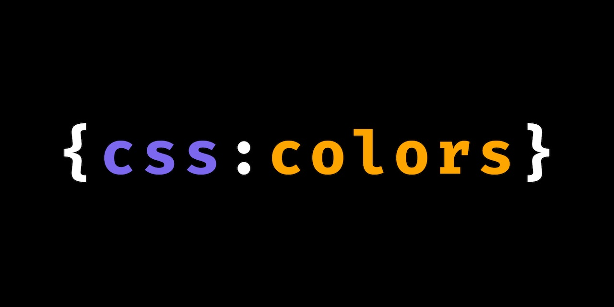
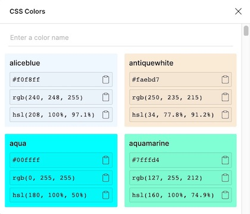

# 🎨 Figma CSS Colors

**Get the value for CSS color keywords in Figma**

> `papayawhip` => `#ffefd5` | `rgb(255, 239, 213)` | `hsl(37, 100%, 92%)`

## How it works?

It opens a **Figma** panel that contains a list of every CSS color keyword. It lets you search by name and copy the values in HEX, RGB or HSL format.

## Having problems?

Take a look if someone already opened [a similar issue](https://github.com/aarongarciah/figma-css-colors/issues?utf8=%E2%9C%93&q=is%3Aissue+sort%3Aupdated-desc+) or [create a new one](https://github.com/aarongarciah/figma-css-colors/issues/new).

## License

MIT

---

Made with ♥️ by [Aarón García Hervás](https://aarongarciah.com)
